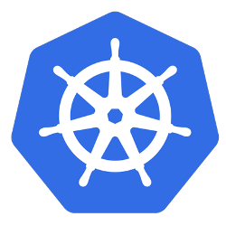
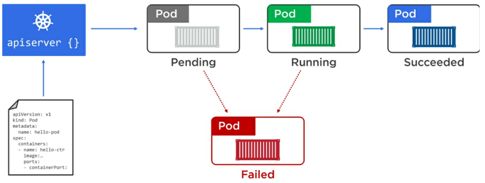
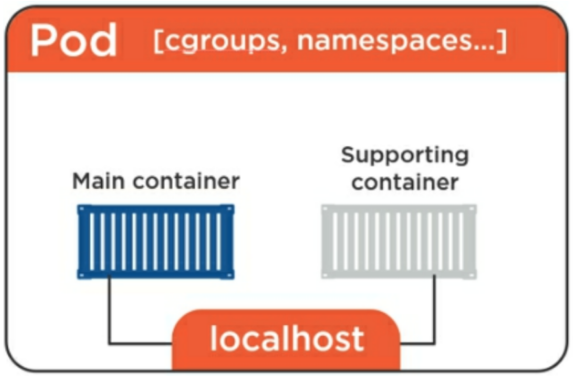
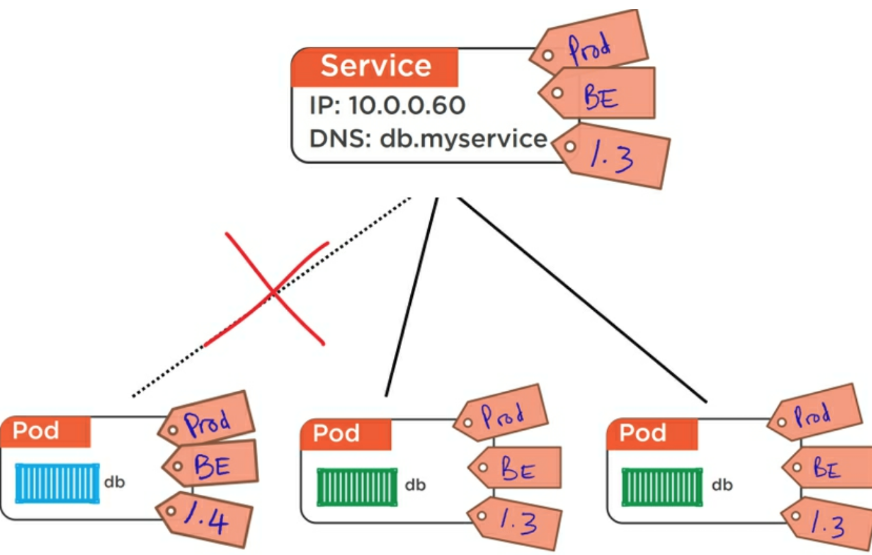

# Kubernetes: Quem é e o que faz?



- Marcelo Silveira Vilar
- tchelovilar@gmail.com


---

# O que é ?

- Orquestrador de Containers
- Apresentado pelo Google em 2014
- A Google possui o próprio orquestrador Borg e Omega
- Vem do Grego (κυβερνήτης), a pessoa que conduz o navio
- K8s, número 8 representa as oito letras entre o K e S.


---

# Motivação para uso

- Moda
- Gerenciamento de Deployment
- Independência de Cloud
- Otimização de Recursos

---

# Otimização de Recursos


---

# Princípios

- Composto por servidores Master e Nodes
- Orquestrar micro serviços, serviços, self-healing, load balancer, rolling updates...
- Declarative model e Desired State
- Objetos: Pods, Services, Deployments, Statefulsets...

---

## Declarative model e Desired State



---

# Pods

- A menor unidade dentro de um Cluster
- Containers são executados dentro de Pods
- Lifecycle: Eles nascem, vivem e morrem, e sua vida pode ser curta

---

## Multi-container Pods

- Usado para situações onde se requer uso compartilhado de recursos
- Compartilhamento da mesma rede, memória compartilhada e volumes.



---

# Services

- Conexão confiável com os endpoints de pods
- Pods morrem, não podemos nos prender a IPs
- Balanceamento
- Vínculo baseado em labels
- Tipos: ClusterIP, Node e Loadbalancer

---

## Service



---

# Estratégia de deploy

## Deployments
- Stateless
- Rolling Deploy

## Statefulsets
- Dados persistentes
- Deploy diferenciado

---

# Lab

- Play with Kubernetes
-- http://play-with-k8s.com
- Minikube
-- https://kubernetes.io/docs/setup/minikube/
- Exemplos
-- https://github.com/kubernetes/examples
- Instalação kubectl
-- https://kubernetes.io/docs/tasks/tools/install-kubectl/
- Exemplos de uso do Kubectl
-- https://kubernetes.io/docs/reference/kubectl/cheatsheet/

---

# Kubernetes como serviço no GCloud

```bash
# Configuração do projeto
gcloud config set project vilar-testes
gcloud config set compute/zone us-east1-b
# Provisionamento
gcloud container clusters create vilar-temp \
       --machine-type=g1-small \
       --num-nodes=2 \
       --cluster-version=1.11.2-gke.15
```

```bash
# Remover cluster
gcloud container clusters delete vilar-temp
```

---

## Deployments

```yaml
apiVersion: apps/v1 
kind: Deployment
metadata:
  name: frontend
spec:
  selector:
    matchLabels:
      app: guestbook
  replicas: 2
  template:
    metadata:
      labels:
        app: guestbook
    spec:
      containers:
      - name: php-redis
        image: tchelovilar/guestbook:latest
        env:
        - name: REDIS_SERVER
          value: "redis"
        ports:
        - containerPort: 80
```

---

## Requests e Limits

```yaml
        resources:
          limits:
            cpu: 1
            memory: 1024Mi
          requests:
            cpu: 50m
            memory: 50Mi
```

---

## Readiness e Liveness Probe

```yaml
       livenessProbe:
          httpGet:
            path: /
            port: 80
        initialDelaySeconds: 30
        periodSeconds: 5
        readinessProbe:
          httpGet:
            path: /
            port: 80
        initialDelaySeconds: 10
        periodSeconds: 5
```

---

## Service

```
apiVersion: v1
kind: Service
metadata:
  name: frontend
  labels:
    app: guestbook
spec:
  type: LoadBalancer
  # ExternalIP, ClusterIP
  ports:
  - port: 80
  selector:
    app: guestbook
```

---

# Perguntas???

- https://github.com/tchelovilar/metup-k8s
- https://github.com/tchelovilar/guestbook