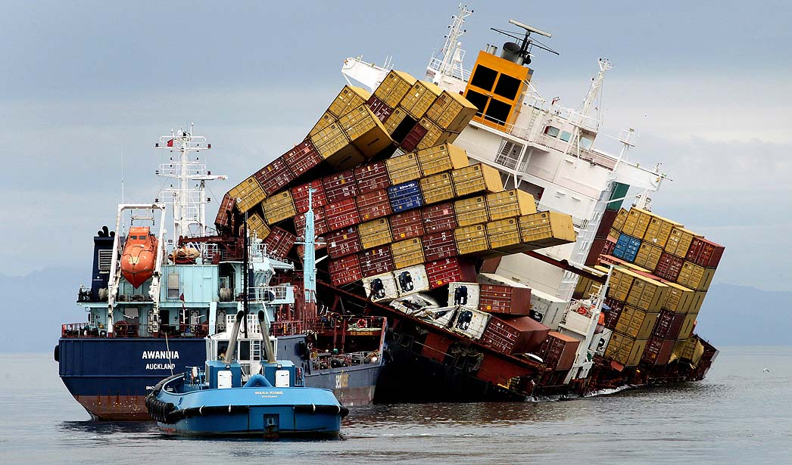

# Kubernetes: Quem é e o que faz?

- Marcelo Vilar
- tchelovilar@gmail.com


---

# O que é ?

- Orquestrador de Containers
- Apresentado pelo Google no verão de 2014
- A Google possui o próprio orquestrador Borg e Omega
- Vem do Grego (κυβερνήτης), a pessoa que conduz o navio
- K8s, número 8 representa as oito letras entre o K e S.


---

# Motivação para uso

- Moda
- Otimização de Recursos
- Gerenciamento de Deployment
- Multi-Cloud

---

# Otimização de Recursos




---

# Princípios

- Orquestrar micro serviços, serviços, self-healing, load balancer, rolling updates...
- Master e Nodes
- Declarative model e Desired State
- Objetos: Pods, Services, Deployments, Statefulsets...

---

## Declarative model e Desired State

img

---

## Pods

Containers são executados dentro de Pods
Lifecycle: Eles nascem, vivem e morrem, e sua vida pode ser curta
Pode ser executado mais de um container em um Pod?

---

## Kubernetes como serviço no GCloud

```bash
# Configuração do projeto
gcloud config set project vilar-testes
gcloud config set compute/zone us-east1-b
# Provisionamento
gcloud container clusters create vilar-temp --machine-type=g1-small --num-nodes=2 --cluster-version=1.11.2-gke.15
```

```bash
# Remover cluster
gcloud container clusters delete vilar-temp
```